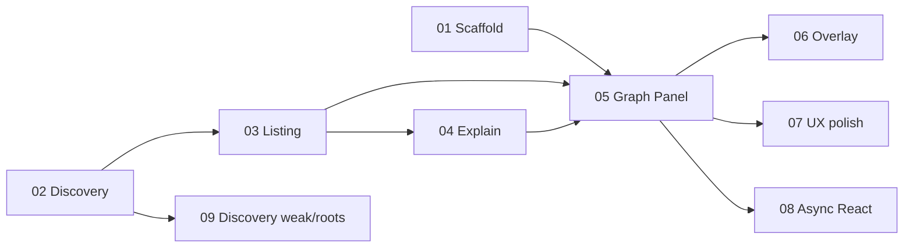

# DI Debugger v1 — ticket index

Spec: [docs/specs/di-debugger-v1.md](../../docs/specs/di-debugger-v1.md)

Work the **frontier**: any ticket whose blockers are done. 01 and 02 can start in parallel.

| #                                                       | Title                                      | Blocked by           |
| ------------------------------------------------------- | ------------------------------------------ | -------------------- |
| [01](./issues/01-scaffold-redi-devtools.md)             | Scaffold `@wendellhu/redi-devtools`        | —                    |
| [02](./issues/02-injector-discovery-registry.md)        | Injector Discovery registry                | —                    |
| [03](./issues/03-debug-registration-listing.md)         | `injector.debug` registration listing      | 02                   |
| [04](./issues/04-resolution-explain.md)                 | Resolution Explain                         | 03                   |
| [05](./issues/05-graph-panel.md)                        | Dependency Graph + Debugger Panel          | 01, 03, 04           |
| [06](./issues/06-overlay-setup.md)                      | Debugger Overlay setup                     | 05                   |
| [07](./issues/07-filter-selection-polling.md)           | Forest filter, selection, polling          | 05                   |
| [08](./issues/08-async-and-react-enrichment.md)         | Async + React enrichment                   | 05 (enrichment ↔ 02) |
| [09](./issues/09-discovery-registry-memory-and-perf.md) | Discovery registry: weak refs + roots only | 02                   |

